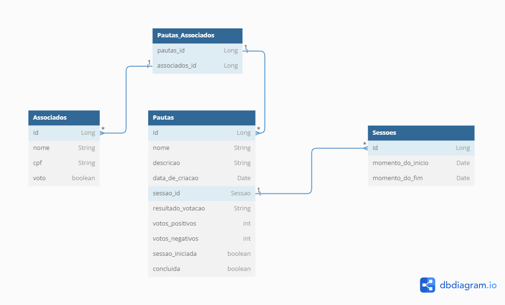

<p align="center">
  <h1 align="center">Sistema Gerenciador de Sessões de Votação</h1>
<p align="center">

[](https://opensource.org/licenses/Apache-2.0)


</p>

## Tabela de Conteúdo

- [Sobre o Projeto](#sobre-o-projeto)
- [Funcionalidades](#funcionalidades)
- [Tecnologias](#tecnologias)
- [Modelo de Dados](#modelo-de-dados)
- [Pré-Requisitos](#pré-requisitos)
- [Como Rodar](#como-rodar)
- [Considerações Finais](#considerações-finais)

## Sobre o Projeto

Esse projeto buscou a implementação de um sistema capaz de gerenciar sessões de votação a partir da criação de pautas e registro de associados com seus respectivos votos.
## Funcionalidades

O sistema permite:

- Cadastrar e consultar associados
- Cadastrar e consultar "sessoes"
- Cadastrar  e consultar pautas
- Definir os votos dos associados durante as sessões de votação
- Contabilizar os votos dos associados e registrar os resultados

## Tecnologias

O sistema foi desenvolvido utilizando as tecnologias abaixo:

| Objetivo | Tecnologia |
| ------ | ------ |
| Linguagem de programação | Java 17 |
| Banco de Dados | MySQL 12 |
| Framework | SpringBoot  |
| Interface para manipulação do banco | MySQL Workbench |
| Documentação | Swagger  |
| Monitoramento | Actuator  |
| Cobertura de Testes | Maven  |
| Conversão de entidades | MapStruct  |
| Testes de Integração | MockMvc  |
| Qualidade | Sonar  |

## Pré-Requisitos

Antes de começar, você precisará ter o Docker instalado em sua máquina.<br>

## Como Rodar

É necessário que você execute o seguinte comando dentro da pasta "docker/database" para subir o serviço em container do banco de dados:
`````
docker-compose up -d
`````
OBS: O software MySQL Workbench não é necessário. Ele pode ser utilizado na falta de plataformas para acesso ao MySQL para monitorar o banco de dados.<br>
Os serviços ficarão disponiveis em:

# [Swagger](http://localhost:8080/swagger-ui/index.html)
`````
http://localhost:8080/swagger-ui/index.html
`````
# [Actuator](http://localhost:8080/actuator)
`````
http://localhost:8080/actuator
`````
## Passo a Passo do Processo de Votação
| Passo | Ação |
| -- | --------------------------------------------------------- |
| 1º |                  Criação de Associados 				      | 
| 2º |                Criação da pauta de Votação                |
| 3º |               Início do Processo de Votação               |
| 4º |         Período de votação feita pelos Associados         |
| 5º |   Conclusão do Processo De Votação após término da sessão |

A API espera, como primeiro passo, que sejam registrados os associados que farão parte das pautas de votação futuras. Após os mesmos terem sido criados, é possível realizar
a criação das pautas de voto, onde o CPF de todos os associados envolvidos é passado como parâmetro.

O processo de votação começa e termina com as funções  "prossegueComVotacaoTempoPadrão" e "prossegueComVotacaoTempoDefinido", as quais estão disponíveis no controller das Pautas e que utiliza como parâmetro o id da pauta cuja 
sessão de votação irá ter início. A escolha entre qual delas usar depende se a pessoa quer definir um tempo de duração (em minutos) para a sessão de votação, tempo este que é definido como parâmetro na função 
"prossegueComVotacaoTempoDefinido", ou se gostaria de continuar com o tempo padrão (1 minuto), sendo que essa escolha só é possível na primeira fase da votação, pois, após uma delas ter sido utilizada, a sessão de votos 
estará aberta e, após o período de votação terminar, qualquer uma destas duas funções poderá ser usada para concluir o processo de votação.

Durante o período da sessão de votação, os associados que foram relacionados com a pauta em questão poderão definir o seu voto a partir 
da função "definirVoto", a qual está disponível no controller dos Associados e recebe como parâmetros o cpf do associado que estará votando e o valor do seu voto, sendo
representado por uma variável do tipo "boolean", onde o valor "true" simboliza um voto em prol da pauta (sim) e o valor "false", por sua vez, simboliza um voto negativo
(não). 

É importante salientar que todo associado já começa na votação com um voto de valor padrão "true", pois, desta forma, caso o mesmo não votar, a pauta não terá a sua 
aprovação prejudicada. 

Durante o período de votação todos os associados podem definir o seu voto quantas vezes quiserem, mas cada um só terá o seu voto contabilizado somente uma vez ao 
final do processo de votação. Desta forma é possível reduzir o número de arrependimentos por mudança de decisão de voto e continua-se recebendo somente um voto 
por associado.

Após o período da sessão de votação ter se encerrado, na próxima vez que uma das funções "prossegueComVotacaoTempoPadrão" e "prossegueComVotacaoTempoDefinido" ser utilizada a mesma irá contabilizar os votos de cada
associado e registrará o resultado da votação, assim como marcará a pauta como concluída.

No quesito do idioma de escrita na parte do desenvolvimento da API foi utilizado o inglês para termos característicos e próprios da programação, mas em
momentos onde são definidas informações ao usuário e, quando são criadas funções mais próprias à API, decidiu-se por utilizar o português para melhor
entendimento de quem for utilizar o sistema e possui como idioma principal o português.

## Modelo de Dados

Abaixo segue o modelo de dados do sistema:

```plantuml

Table Associados {
	id Long 
	nome String 
	cpf String 
	voto boolean 
}

Table Pautas {
	id Long 
	nome String
	descricao String
	data_de_criacao Date
	sessao_id Long
	resultado_votacao String
	votos_positivos int
	votos_negativos int
	sessao_iniciada boolean 
	concluida boolean 
}

Table Pautas_Associados {
	pautas_id Long 
	associados_id Long
}

Table Sessoes {
	id Long 
	momento_do_inicio Date 
	momento_do_fim Date 
}
```

# Considerações Finais

A solução a qual eu desenvolvi torna possível não só participar de um sistema de votos de associados em Pautas, mas também torna possível o controle dos dados persistidos em banco de dados a partir de funcionalidades de substituição e exclusão das entidades que fazem parte do processo de votação.
Foram utilizados diferentes tipos de validações para os valores fornecidos pelo usuário e testes unitários e de integração para validação dos métodos existentes, sendo que, para os testes de integração, foi utilizado um banco H2 em memória buscando atender a boas práticas.

Algumas ferramentas foram usadas ou incluídas por boas práticas, um banco H2 em memória para testes foi criado.

A ferramenta `Swagger` foi configurado para organização da documentação, onde cada endpoint pode ter sua própria descrição e grupo de alocação na documentação, além de também servir como client para a API desenvolvida.

O software `Actuator` foi introduzido na aplicação com o objetivo de expor algumas informações do sistema de forma mais didática ao usuário.

Na camada de serviço, foram utilizadas interfaces que atuam nos controllers ao invés das classes onde a implementação dos serviços de fato se encontra, o que resulta em uma maior segurança para os principais métodos de serviço que utilizam diretamente importantes funções do repositório.

Para o versionamento da API foi utilizada a tática de especificar a versão, por exemplo, "v1" para os controllers da aplicação em seus endereços (Ex: v1/associados), além de transferir os arquivos das classes dos níveis de serviço e repositório para uma pasta contendo como nome a versão 
mencionada.
Este método de versionamento acaba sendo muito eficaz no sentido de economia, pois exclui a necessidade de se criar outras APIs inteiras e de hospedar cada uma delas ao fazer qualquer alteração funcional no código. 

Portanto, acredito que a minha solução tenha cumprido com os requisitos do desafio ao permitir o gerenciamento e a participação ativa nas sesões de votação. Mesmo o projeto atual já servindo como demonstração de conhecimento técnico, eu tenho certeza que outras funcionalidades 
interessantes também poderiam ter sido agregadas ao código, como a integração com sistemas externos ou testes de performance, ideias estas que foram sugeridas na apresentação do desafio.